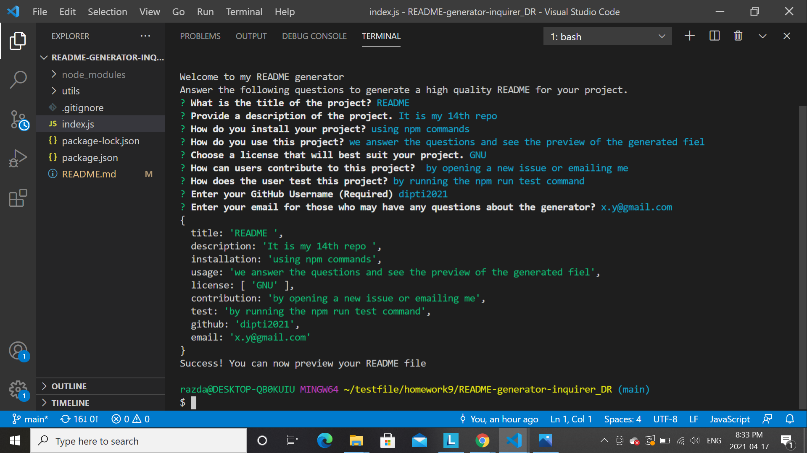
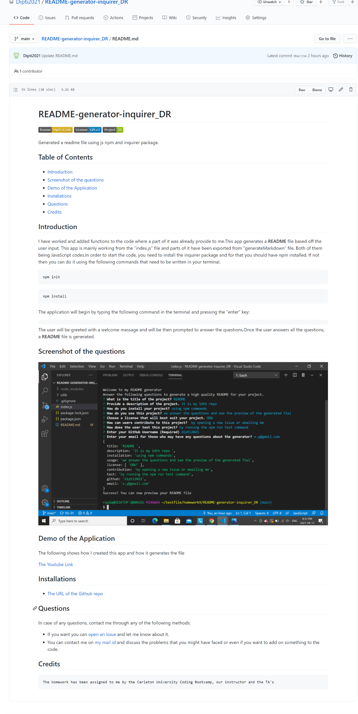

# README-generator-inquirer_DR


Generated a readme file using js npm and inquirer package.

## Table of Contents
* [Introduction](#introduction)
* [Screenshot of the questions](#scr)
* [Screenshot of the README](#scread)
* [Demo of the Application](#web)
* [Installations](#installations)
* [Questions](#ques)
* [Credits](#credits)

 ## Introduction 
 I have worked and added functions to the code where a part of it was already provide to me.This app generates a __README__ file based off the  user input. This app is mainly working from the "index.js" file and parts of it have been exported from "generateMarkdown"  file. Both of them being JavaScript codes.In order to start the code, you need to install the inquirer package and for that you should have npm installed. If not then you can do it using the following commands that need to be written in your terminal. 
 ```
npm init
```
```
npm install
```

 
 The application will begin by typing the following command in the terminal and pressing the "enter" key:
 ```
node index.js
```
The user will be greeted with a welcome message and will be then prompted to answer the questions.Once the user answers all the questions, a __README__ file is generated.
 
 ## Screenshot of the questions
 
 
 ## Screenshot of the README
 

 ## Demo of the Application
 The following shows how I created this app and how it generates the file. I may make some chagnges to the code to make it more clean. But more or less, it is almost an exact representation of the code

 [The Youtube Link](https://www.youtube.com/watch?v=o8hkjz1TQuQ)
 

 
 ## Installations
   * [The URL of the Github repo](https://github.com/Dipti2021/README-generator-inquirer_DR)
   

 ## Questions
In case of any questions, contact me through any of the following methods:
 * If you want you can [open an issue](https://github.com/Dipti2021/README-generator-inquirer_DR/issues) and let me know about it.
 * You can contact me on [my  mail id](mailto:dipti.raina@gmail.com) and discuss the problems that you might have faced or even if you want to add on something to the code.


    
 ## Credits
    The homework has been assigned to me by the Carleton University Coding Bootcamp, our instructor and the TA's
